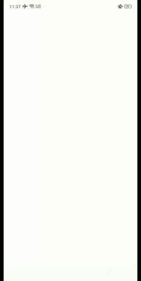

# Pengolahan Citra Digital (Image Processing)

- Description : This is an Android Application for Image Processing, written in kotlin.
- Disclaimer : All the process run in CPU, not GPU so it might take several minutes to operate in high size image.

## Features

### Get Image Information

- Height
- Width
- Size
- Etc

### Set Image Filters

- Grayscale
- Negative
- Monochrome

### Set Image Flipping

- Flip Horizontal
- Flip Vertical

### Set Image Rotating

- Rotate 90 Left
- Rotate 90 Right

### Rise up a Noise

- Salt and Pepper

### Image Restoration

- Filter Average Method (3x3)

## Showcase

## Build

- Just clone the whole code and run it via Android Studio :>